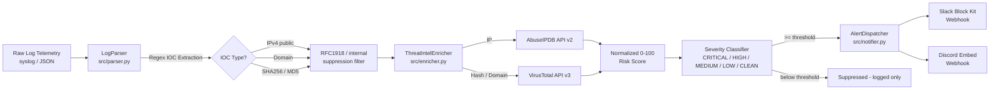

# 🛡️ Automated SOC Incident Response & Threat Alerting Pipeline

A production-grade, enterprise-ready Python pipeline that ingests raw security
log telemetry, automatically extracts Indicators of Compromise (IOCs),
enriches them against real-time threat intelligence sources, and dispatches
rich, color-coded incident alerts to Slack and Discord — with zero manual
triage required for well-understood threat patterns.

---

## Architecture Flow



**ASCII fallback:**

```
 Raw Logs (JSON/syslog)
        |
        v
 [ parser.py ]  --regex-->  IOCs (IPv4, domain, SHA256, MD5)
        |                          |
        |                 RFC1918 / internal suppression
        v                          |
 [ enricher.py ] <-----------------+
        |  \
        |   \--> AbuseIPDB API v2  (IP reputation)
        |   \--> VirusTotal API v3 (hash / domain reputation)
        v
 Normalized risk score (0-100) --> Severity (CRITICAL/HIGH/MEDIUM/LOW/CLEAN)
        |
        v
 [ notifier.py ] --> Slack Block Kit webhook
        |         \-> Discord Embed webhook
        v
 Color-coded incident alert delivered to SOC channel
```

---

## Features

- **Dual-format log ingestion** — structured JSON event arrays or raw
  RFC3164-style syslog lines.
- **Regex-based IOC extraction** — public IPv4 addresses, domains,
  SHA256 hashes, and MD5 hashes, including de-fanged notation
  (`hxxp://`, `[.]`) normalization.
- **RFC1918 + internal suppression** — private/loopback/link-local IPs and
  internal-use domain suffixes (`.local`, `.internal`, `.corp`, etc.) are
  filtered out before ever reaching an external API.
- **False-positive hardening** — filters out file-extension look-alikes
  (`invoice_update.exe`) and sentence-case prose that resembles a hostname
  (`Trojan.Generic`).
- **Real-time enrichment** against **VirusTotal API v3** (files/domains) and
  **AbuseIPDB API v2** (IP reputation), with:
  - Token-bucket rate limiting tuned to each provider's plan.
  - Exponential backoff with jitter on HTTP 429 / 5xx / network errors.
  - Graceful, non-fatal error handling — a failed lookup never crashes the
    run.
- **Deterministic mock mode** — run the entire pipeline end-to-end, including
  simulated malicious verdicts, with zero API keys configured. Ideal for
  demos, CI, and offline development.
- **Rich, color-coded alerting**:
  - Slack via **Block Kit** (header, fields, IOC sections) wrapped in a
    colored attachment strip.
  - Discord via **rich Embeds** with matching severity colors.
  - Severity levels: `CRITICAL` 🔴 · `HIGH` 🟠 · `MEDIUM` 🟡 · `LOW` 🔵 ·
    `CLEAN` 🟢.
- **Configurable notification threshold** — only dispatch alerts at or above
  a minimum severity, keeping SOC channels signal-heavy, not noisy.
- **Fully typed & validated** data models via Pydantic.
- **Comprehensive pytest suite** covering extraction, filtering, scoring,
  payload construction, and full end-to-end runs.

---

## Prerequisites

- Python **3.10+** (uses `X | Y` union type syntax)
- `pip` for dependency installation
- (Optional, for live mode) API keys / webhooks for:
  - [VirusTotal](https://www.virustotal.com/gui/my-apikey)
  - [AbuseIPDB](https://www.abuseipdb.com/account/api)
  - A [Slack Incoming Webhook](https://api.slack.com/messaging/webhooks)
  - A [Discord Webhook](https://support.discord.com/hc/en-us/articles/228383668-Intro-to-Webhooks)

---

## Project Structure

```
soc_ir_pipeline/
├── config/
│   └── config.yaml          # Thresholds, rate limits, severity colors, test_mode flag
├── data/
│   └── sample_logs.json     # 5 realistic sample security events
├── src/
│   ├── __init__.py
│   ├── parser.py            # Log ingestion + IOC regex extraction
│   ├── enricher.py          # VirusTotal / AbuseIPDB enrichment + mock mode
│   ├── notifier.py          # Slack Block Kit + Discord Embed dispatch
│   └── main.py               # Orchestration + CLI entrypoint
├── tests/
│   └── test_pipeline.py     # Pytest suite (unit + end-to-end)
├── .env.example              # Secrets template
├── .gitignore
├── requirements.txt
└── README.md
```

---

## Setup Instructions

```bash
# 1. Clone / unzip the project, then enter it
cd soc_ir_pipeline

# 2. Create and activate a virtual environment
python3 -m venv .venv
source .venv/bin/activate        # Windows: .venv\Scripts\activate

# 3. Install dependencies
pip install -r requirements.txt

# 4. Configure secrets
cp .env.example .env
# Edit .env and fill in your real API keys / webhook URLs
# (Not required if you're just running in mock/test mode!)
```

### Environment Variables

| Variable               | Required for      | Description                                  |
|-------------------------|--------------------|-----------------------------------------------|
| `VIRUSTOTAL_API_KEY`    | Live domain/hash lookups | VirusTotal API v3 personal or org key |
| `ABUSEIPDB_API_KEY`     | Live IP lookups    | AbuseIPDB API v2 key                          |
| `SLACK_WEBHOOK_URL`     | Live Slack alerts  | Incoming Webhook URL for your SOC channel     |
| `DISCORD_WEBHOOK_URL`   | Live Discord alerts| Webhook URL for your SOC/alerts channel       |

None of these are required in **mock mode** (`test_mode: true` in
`config/config.yaml`, the default) — the pipeline simulates realistic
enrichment scores and logs alert payloads instead of sending them.

---

## Running the Pipeline

### Mock mode (no API keys needed — default)

```bash
python -m src.main --log-file data/sample_logs.json
```

### Force mock mode explicitly

```bash
python -m src.main --log-file data/sample_logs.json --test-mode
```

### Live mode (real API calls + real webhook delivery)

```bash
# Requires VIRUSTOTAL_API_KEY, ABUSEIPDB_API_KEY, SLACK_WEBHOOK_URL,
# DISCORD_WEBHOOK_URL to be set in .env
python -m src.main --log-file data/sample_logs.json --live
```

### Custom config or log source

```bash
python -m src.main --log-file /path/to/your/logs.json --config config/config.yaml
```

---

## Running Tests

```bash
pytest tests/ -v
```

Expected output (abridged):

```
tests/test_pipeline.py::TestPrivateIPFiltering::test_private_ips_are_flagged[10.0.0.1] PASSED
tests/test_pipeline.py::TestIOCExtraction::test_extracts_public_ipv4 PASSED
tests/test_pipeline.py::TestIOCExtraction::test_defanged_domain_is_extracted PASSED
tests/test_pipeline.py::TestSeverityClassification::test_classify_severity_thresholds[80-CRITICAL] PASSED
tests/test_pipeline.py::TestMockEnrichment::test_known_malicious_ip_scores_high PASSED
tests/test_pipeline.py::TestNotifierPayloads::test_slack_payload_structure PASSED
tests/test_pipeline.py::TestNotifierPayloads::test_discord_payload_structure PASSED
tests/test_pipeline.py::TestEndToEndPipeline::test_pipeline_runs_against_sample_logs PASSED
========================== 24 passed in 0.42s ==========================
```

---

## Sample Output

Running against the bundled `data/sample_logs.json` in mock mode produces:

```
======================================================================
PIPELINE RUN SUMMARY
======================================================================
[CRITICAL] evt-1001     ssh_brute_force          host=prod-bastion-01     iocs=1 notified=True
[CRITICAL] evt-1002     malware_file_download    host=ws-finance-014      iocs=2 notified=True
[CRITICAL] evt-1003     c2_beaconing             host=ws-engineering-221  iocs=2 notified=True
[   CLEAN] evt-1004     internal_safe_traffic    host=ws-marketing-055    iocs=0 notified=False
[    HIGH] evt-1005     port_scan                host=fw-edge-03          iocs=1 notified=True
======================================================================
```

### Example Slack alert (rendered Block Kit payload)

```
🔴 CRITICAL Severity Alert
────────────────────────────
Event ID:      evt-1003
Event Type:    c2_beaconing
Host:          ws-engineering-221
Timestamp:     2026-08-20T14:02:55Z

Summary:
Outbound connection detected: internal host 10.10.4.22 established
repeated beacon-pattern HTTPS connections to external host
198.51.100.77, resolving to domain malicious-c2-server.badnet.

IPV4: 198.51.100.77
  Score: 87/100 | Provider: abuseipdb (mock) | Votes: 34/150

DOMAIN: malicious-c2-server.badnet
  Score: 90/100 | Provider: virustotal (mock) | Votes: 81/90

Automated SOC Incident Response & Threat Alerting Pipeline
```

### Example Discord embed (JSON payload excerpt)

```json
{
  "embeds": [
    {
      "title": "🔴 CRITICAL Severity Alert",
      "description": "Outbound connection detected...",
      "color": 16711680,
      "fields": [
        {"name": "Event ID", "value": "evt-1003", "inline": true},
        {"name": "Event Type", "value": "c2_beaconing", "inline": true},
        {"name": "Host", "value": "ws-engineering-221", "inline": true},
        {
          "name": "DOMAIN: malicious-c2-server.badnet",
          "value": "Score **90/100** via `virustotal (mock)` (81/90 votes)"
        }
      ],
      "footer": {"text": "Automated SOC Incident Response & Threat Alerting Pipeline"}
    }
  ]
}
```

---

## Extending the Pipeline

- **New IOC types** (e.g. URLs, email addresses): add a regex + extraction
  branch in `src/parser.py`, then a corresponding `_enrich_*` method in
  `src/enricher.py`.
- **New alert channels** (e.g. PagerDuty, Microsoft Teams, email): implement
  a class in `src/notifier.py` matching the `send(alert: AlertCard)` pattern
  and register it in `AlertDispatcher`.
- **New telemetry sources**: add a loader method to `LogParser` (e.g. CEF,
  LEEF, CSV) alongside `load_json_file` / `parse_syslog_lines`.
- **SIEM/SOAR integration**: `run_pipeline()` in `src/main.py` returns a
  structured list of per-event summaries suitable for forwarding to a
  ticketing system or case management platform.

---

## Security & Operational Notes

- API keys and webhook URLs are **never** hardcoded — they're loaded from
  environment variables via `python-dotenv`, and `.env` is git-ignored.
- All outbound HTTP calls use per-provider rate limiting and bounded
  exponential backoff to respect API terms of service and avoid hammering
  endpoints during incident storms.
- IOC suppression (RFC1918 IPs, internal domain suffixes) happens **before**
  any data leaves your network boundary toward third-party APIs.
- Mock mode is deterministic (seeded by IOC value hash) so the same IOC
  always yields the same simulated verdict across runs — safe for automated
  testing and CI pipelines.

---

## License

This project is provided as a reference implementation for educational and
internal SOC tooling purposes. Adapt and harden as appropriate for your
production environment before connecting it to live infrastructure.
